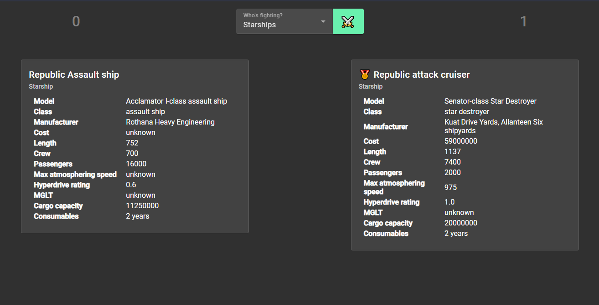

# StarshipsAndPeople

> Recruitment take-home task for measuring THE FORCE™.

Simple application/game that displays 2 entities from the Star Wars universe side by side. It declares one of the "opponents" a winner based on the common numerical attribute. It keeps score of the battles won by each "player".

## Requirements

- node@16.20.1 (refer to Angular@16.2.x at https://angular.io/guide/versions for more versions)
- npm
- Internet connection (relies on external API: https://www.swapi.tech/)

## Setup

Run `npm i` to install dependencies.

## Development

### Code style

This project is configured with:

- eslint
- stylelint

Consider installing related extensions in your IDE before proceeding with changes.

Also recommended:

- Code Spell Checker (VSCode only)

## Dev server

Run `ng serve` for a dev server. Navigate to `http://localhost:4200/`. The application will automatically reload if you change any of the source files.

## Build

Run `ng build` to build the project. The build artifacts will be stored in the `dist/` directory.

## Running unit tests

Run `ng test` to execute the unit tests via [Karma](https://karma-runner.github.io).

## Running end-to-end tests

Run `npx cypress open` to execute e2e tests via Cypress.

## Further help

To get more help on the Angular CLI use `ng help` or go check out the [Angular CLI Overview and Command Reference](https://angular.io/cli) page.
